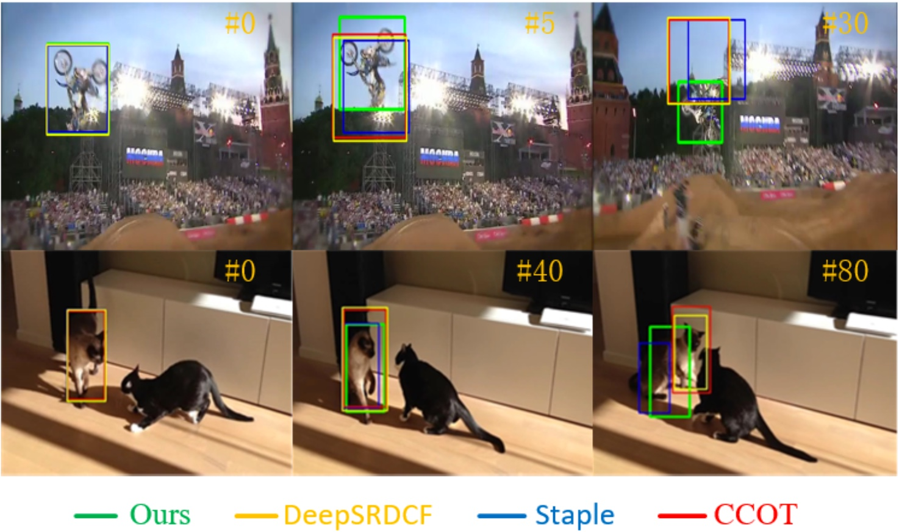

## Correlation Filters with Weighted Convolution Responses<sub>([ICCV2017W](http://openaccess.thecvf.com/content_ICCV_2017_workshops/papers/w28/He_Correlation_Filters_With_ICCV_2017_paper.pdf))</sub>
By Zhiqun He, Yingruo Fan, Junfei Zhuang, Yuan Dong, Hongliang Bai

### Introduction
 
 
>We derive a continuous convolution operator based tracker which
fully exploits the discriminative power in the CNN feature
representations. In our work, we normalize each individual feature extracted from different layers of the deep pretrained CNN first, and after that, the weighted convolution responses from each feature block are summed to produce the final confidence score. By this weighted sum operation, the empirical evaluations demonstrate clear improvements
by our proposed tracker based on the Efficient Convolu- tion Operators Tracker (ECO).  

## Requirements
1、Download the CFWCR code and the pretrained models

```
git clone https://github.com/he010103/CFWCR.git
cd ./feature_extraction/networks
wget http://www.vlfeat.org/matconvnet/models/imagenet-vgg-m-2048.mat. 
mv  imagenet-vgg-m-2048.mat imagenet-vgg-m-2048-cut.mat
```
2、Downloading MatConvNet and compile it 

```
cd ./external_libs
git clone https://github.com/vlfeat/matconvnet.git
```
[More install details](http://www.vlfeat.org/matconvnet/install/)

3、Install all the dependencies

Fill the cuda(>=7.5) path in the install.m first.

```
run install.m
```

4*、Setting export CUDA_CACHE_MAXSIZE=8000000000" in the ./~bash_profile so that gpuDevice(1) will take fewer time.


## Demo
1、 run demo_CFWCR.m()

## VOT 
2、[VOT Intergration] ./vot2017_trax


## Citing DCFNet

If you find [**CFWCR**](http://openaccess.thecvf.com/content_ICCV_2017_workshops/papers/w28/He_Correlation_Filters_With_ICCV_2017_paper.pdf) useful in your research, please consider citing:

```
@article{CFWCR,
    Author = {hiqun He, Yingruo Fan, Junfei Zhuang, Yuan Dong, Hongliang Bai},
    Title = {Correlation Filters with Weighted Convolution Responses},
    Journal = {IEEE International Conference on Computer Vision},
    Year = {2017}
}
```   
